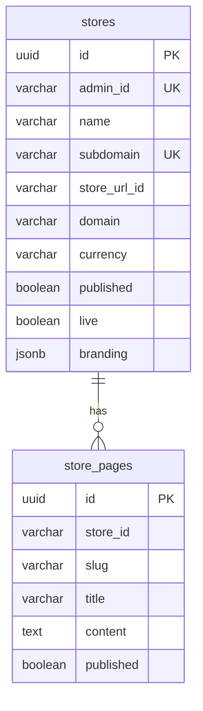

# store-service

Merchant store records, custom domains, and CMS pages. Port **3008**, schema **`store_svc`**.

Platform design: [System design](https://github.com/digi-carts/doc/blob/main/architecture/system-design.md)

## Domain

A store is owned by one `admin_id` (unique), has unique `subdomain` / optional `store_url_id` / custom `domain`, currency (default INR), `published` / `live` flags, visit count, trial `available_days`, `template`, and `branding` JSON.

`StorePage` is markdown/HTML content keyed by `store_id` + `slug` (about, policies, etc.).

**storefront-service** also maps JPA `Store` onto **`store_svc`**. Treat this service as the write owner; storefront-service as a read-oriented resolver. Dual writers against the same schema are a coordination risk.

## Tech stack

Java 21, Spring Boot 3.3.0, Web, JPA, Validation, Liquibase, PostgreSQL.

## Data model



## HTTP API

Gateway: `/api/stores/**`, `/api/domain/**`, `/api/pages/**`.

### Stores — `/stores`

| Method | Path |
|--------|------|
| GET | `/stores` |
| GET | `/stores/{id}` |
| GET | `/stores/admin/{adminId}` |
| GET | `/stores/subdomain/{subdomain}` |
| POST | `/stores` |
| PUT | `/stores/{id}` |
| DELETE | `/stores/{id}` |

### Pages — `/store-pages`

| Method | Path |
|--------|------|
| GET | `/store-pages` |
| GET | `/store-pages/{id}` |
| GET | `/store-pages/store/{storeId}` |
| GET | `/store-pages/store/{storeId}/slug/{slug}` |
| POST | `/store-pages` |
| PUT | `/store-pages/{id}` |
| DELETE | `/store-pages/{id}` |

### Health

`GET /health`

## Configuration

| Variable | Required | Default |
|----------|----------|---------|
| `DATABASE_URL` | yes | schema `store_svc` |
| `PORT` | no | `3008` |

## Local run

```bash
export DATABASE_URL="jdbc:postgresql://localhost:5432/digicarts?currentSchema=store_svc"
mvn spring-boot:run
```

## CI/CD

`digi-cart-store-service-dev` / `digi-cart-store-service`.

## Related

- [storefront-service](https://github.com/digi-carts/storefront-service/blob/stage/doc/README.md)
- [storefront](https://github.com/digi-carts/storefront/blob/stage/doc/README.md)
- [merchant-ui](https://github.com/digi-carts/merchant-ui/blob/stage/doc/README.md)

## REST API reference

See [api.md](api.md) for every HTTP endpoint generated from Spring controllers.
